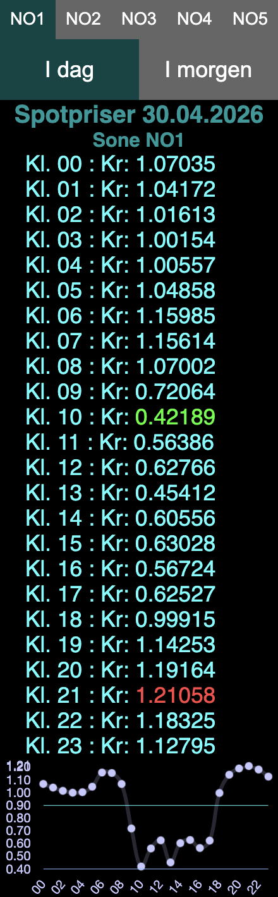

# spotpris-widget

En enkel HTML-widget som viser norske spotpriser for strøm time for time, med støtte for alle prisområder (NO1–NO5).

Laget for bruk som skrivebordswidget via [Plash](https://sindresorhus.com/plash) på Mac, men fungerer like godt som en lokal HTML-fil eller hostet nettside.

---

## Skjermbilde



---

## Funksjoner

- Viser dagens og morgendagens spotpriser time for time
- Markerer høyeste pris (rød) og laveste pris (grønn)
- Linjediagram med gjennomsnitts- og norgesprismarkering
- Norgespris-linjen viser 0,40 kr/kWh
- Velg prisområde (NO1–NO5) direkte i widgeten
- Husker valgt prisområde og aktiv fane mellom lastetider
- Priser for i morgen vises ikke før etter kl. 14:00 (da de publiseres)
- Cacher data i `localStorage` for å unngå unødvendige API-kall
- Gjennomsiktig bakgrunn med justerbar opacity — lar skrivebordsbildet synes igjennom
- Ingen bygg-steg, ingen avhengigheter utover CDN-biblioteker

---

## Bruk

### Lokal fil
Last ned `index.html` og åpne den direkte i nettleseren.

### Hostet
Last opp `index.html` til en hvilken som helst webserver.

### Plash (Mac skrivebordswidget)
1. Installer [Plash](https://sindresorhus.com/plash)
2. Last ned `index.html`
3. Pek Plash til den lokale filen
4. Velg prisområde og plassering direkte i widgeten — innstillinger lagres automatisk

---

## Tilpasning via URL-parametere

For bruk utenfor Plash eller som hostet fil kan oppførsel styres via URL-parametere:

| Parameter | Beskrivelse | Standard |
|-----------|-------------|---------|
| `zone` | Prisområde (`NO1`–`NO5`) | `NO1` |
| `opacity` | Bakgrunnsopasitet (`0`–`1`) | `0.5` |
| `top` | Vertikal margin fra toppen (em) | `20` |
| `left` | Horisontal margin fra venstre (em) | `0` |

Eksempel:
```
index.html?zone=NO2&opacity=0.7&top=10&left=2
```

Merk: Plash støtter ikke URL-parametere på lokale filer. Bruk knappene i widgeten for å velge prisområde, og juster `marginTop`/`marginLeft` og `opacity` direkte i `index.html` for Plash-bruk.

---

## API

Prisdata hentes fra [hvakosterstrommen.no](https://www.hvakosterstrommen.no) sitt åpne API. Ingen API-nøkkel kreves.

---

## Avhengigheter (CDN)

- [Chart.js 2.9.4](https://www.chartjs.org/)
- [chartjs-plugin-annotation 0.5.7](https://github.com/chartjs/chartjs-plugin-annotation)
- [json2html 2.1.0](https://www.json2html.com/)

---

## Lisens

Fritt å bruke og modifisere til eget bruk.
